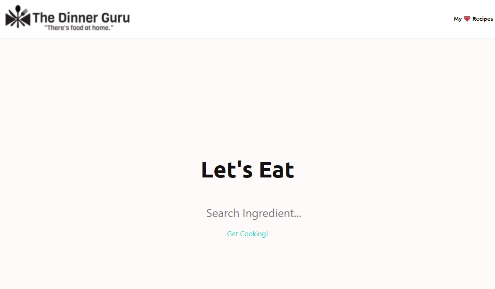

# Interactive Front-End Project #1 The Dinner Guru

Working professionals, especially parents, are requesting a simple web application that connects them to simple and easy recipes using ingredients they already have in their kitchen at home. Utilizing HTML, CSS, and JavaScript coding languages, along with two server-side API's, client side storage, and Foundation framework, we developed a mobile ready, interactive web based application, to solve this problem, and making cooking at home easier. 

## Acceptance Criteria

GIVEN a web application fulfills all requirements   
WHEN I view the web application  
THEN I can interact and accept and respond to user input  
WHEN I open the web application  
THEN I can view and use the app on all screen sizes (mobile, laptop, desktop)  
WHEN I interact with the application  
THEN I have a polished and styled web app using a CSS framework other than Bootcamp  
WHEN I see a recipe I want to try  
THEN I can save the recipe using client-side storage  
WHEN I open the application  
THEN I am not alerted with prompt windows  
WHEN I inspect the code   
THEN I see good quality coding standards being utilized  
WHEN I view the structure of the web application  
THEN I find that at least 2 server-side APIs.  

## Screenshot/Demo

## Links
github: https://github.com/detrasmental/the-dinner-guru  

live page: [live link]
